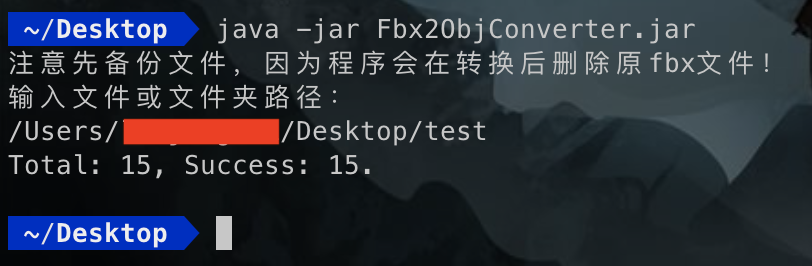

# Fbx2ObjConverter
使用 aspose.3d 将 fbx 文件转换为 obj+mtl。

给定路径，会将这个文件夹下的所有 fbx 文件转换为 obj+mtl，同时删除原来的 fbx。



由于 aspose 的限制，每次运行最多转换 50 个文件，所以文件多的时候遇到下面的报错是正常的，多次运行处理完所有文件即可。
```
You are using an evaluation copy and have opened files exceeding limitation.
```
